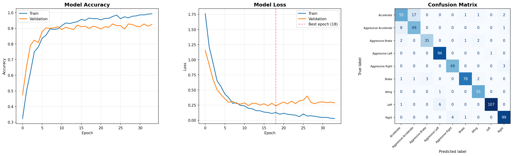

# Driving Behavior Classifier

An end-to-end machine learning pipeline that classifies driving behaviors from IMU sensor data (gyroscope + accelerometer) using a 1D Convolutional Neural Network, optimized for deployment on ESP32-S3 microcontrollers.

## TLDR

The system identifies 9 driving events in real time from a 6-axis inertial measurement unit (MPU6050):

| Class | Driving Event         |
|-------|-----------------------|
| 0     | Acceleration          |
| 1     | Aggressive Accelerate |
| 2     | Aggressive Brake      |
| 3     | Aggressive Left       |
| 4     | Aggressive Right      |
| 5     | Brake                 |
| 6     | Idling                |
| 7     | Left                  |
| 8     | Right                 |


Raw sensor streams are windowed, normalized, and fed into a lightweight 1D CNN (~5,108 parameters) that runs as a quantized INT8 model on a ESP32-S3 (FREENOVE)

The point of this is to embed the quantized model to a small ESP32 so that it can classify truck driving behavior using edge compute.
- The main motivation is to reduce power consumption and latency when classifying driving behavior using IoT
- Compared to sending raw sensor data to the cloud -- which is more resource intensive -- edge compute helps reduce this power draw.

---

## Architecture

### ML Pipeline

```
driving_events.db
      │
      ▼
┌─────────────────┐
│ Session Parsing  │  Split by time gaps > 5s within DriverID/TaskID pairs
└────────┬────────┘
         ▼
┌─────────────────┐
│ Sliding Window   │  7 timesteps, hop 3 → overlapping windows (data augmentation)
└────────┬────────┘
         ▼
┌─────────────────┐
│ Z-Score Norm     │  Per-channel mean/std fitted on training set only
└────────┬────────┘
         ▼
┌─────────────────┐
│ Augmentation     │  Gaussian noise (σ=0.05), scaling jitter (0.9–1.1), DC offset
└────────┬────────┘
         ▼
┌─────────────────┐
│ 1D CNN           │  2× Conv1D → MaxPool → Dense → Softmax (4 classes)
└────────┬────────┘
         ▼
┌─────────────────┐
│ Export           │  Keras → TFLite F32 → TFLite INT8 → C header (.h)
└─────────────────┘
```

### Model Architecture

```
Input (7, 6)                         # 7 timesteps × 6 sensor channels
    │
    ├── Conv1D(16, kernel=3, same) + ReLU
    ├── Conv1D(32, kernel=3, same) + ReLU
    ├── MaxPool1D(2)                 # (7,32) → (3,32)
    ├── Dropout(0.3)
    ├── Flatten
    ├── Dense(32) + ReLU
    ├── Dropout(0.4)
    └── Dense(4) + Softmax          

```

**Design:**
- **16/32 filters** (not 64/128) — keeps model under 10 KB for ESP32-S3 (512 KB SRAM)
- **kernel_size=3** — receptive field covers 3 seconds at 1 Hz
- **Single MaxPool(2)** — (7,32) → (3,32); sequence too short to pool further
- **Dropout 0.3/0.4** — aggressive regularization for a small dataset
- **7-step window** — matches the shortest driving event (Sudden Brake)

### Training Strategy

- **Split:** Stratified Group K-Fold by DriverID — prevents data leakage across drivers
- **Class weights:** Balanced, computed from training distribution
- **Early stopping:** Patience of 25 epochs (max 200)
- **Optimizer:** Adam (lr=1e-3) with learning rate reduction on plateau
- **Batch size:** 16

### Deployment Target

| Artifact | Size | Purpose |
|----------|------|---------|
| `driving_cnn.keras` | 2.89 MB | Full-precision Keras model |
| `driving_cnn_f32.tflite` | 953 KB | TFLite float32 |
| `driving_cnn_int8.tflite` | 248 KB | INT8 quantized for ESP32-S3 |
| `driving_cnn_model.h` | 1.55 MB | C header for firmware embedding |
| `norm_params.npy` | — | Normalization params for on-device preprocessing |

---

## Dataset Overview

* **Sources:**
    * [Driving Behavior Dataset — MPU6050](https://data.mendeley.com/datasets/jj3tw8kj6h/3) (Yuksel, 2021)
    * [Driving Events — smartphone sensors](https://doi.org/10.7910/DVN/F5JZHF) (Goh, 2021)
* **Shape:** 1,114 rows × 12 columns
* **Features:** 6 sensor channels (GyroX, GyroY, GyroZ, AccX, AccY, AccZ), timestamps
* **Data Quality:** No missing values, no duplicates
* **Sampling Rate:** ~52 Hz 
* **Class Distribution:** .....

## Sensor Insights & EDA

Initial exploratory data analysis (Yuksel, 2021) reveals:
* **High Variance & Noise:** `GyroZ` exhibits the widest range (std = 12.0) and is the noisiest channel (51 identified outliers).
* **Correlations:**
  * *Strong Positive:* `GyroZ` ↔ `AccY` (r = 0.82). These channels are heavily coupled, likely representing yaw-related motion.
  * *Moderate Negative:* `GyroX` ↔ `GyroZ` (r = -0.46) and `GyroX` ↔ `AccY` (r = -0.42).
* **Low Signal Value:** `AccZ` hovers around -1.0 (gravity component) with low variance — limited discriminative signal.
* **Outliers:** 89 rows (8%) have at least one channel with `|z| > 3`. Handled via z-score normalization during preprocessing.

---

## Training Results



---

## Impact & Applications

**Edge-deployed driving behavior classification** 
---

## Tech Stack

| Component | Tool |
|-----------|------|
| Model training | TensorFlow 2.21 / Keras |
| Data splitting & metrics | scikit-learn 1.8 |
| Data processing | pandas 3.0, NumPy 2.4 |
| TFLite inference | LiteRT |
| Visualization | Matplotlib 3.10 |
| Target hardware | ESP32-S3 (Xtensa LX7, 512 KB SRAM) |

## Getting Started

```bash
# Clone and set up
git clone https://github.com/tylerrleee/driving-classifier
cd driving-classifier
python -m venv .venv
source .venv/bin/activate
pip install -r requirements.txt

# Run the full training pipeline
python /driving_cnn_pipeline.py

# Outputs saved to /output/:
#   driving_cnn.keras, driving_cnn_int8.tflite, driving_cnn_model.h
```

---

## References

- Amidi Afshine, Amidi Shervine. Convolutional Neural Networks. https://stanford.edu/~shervine/teaching/cs-230/cheatsheet-convolutional-neural-networks/

- Goh, Vik Tor; Jamal Mohd Lokman, Eilham Hakimie; Yap, Timothy Tzen Vun; Ng, Hu, 2021, "Driving Events", https://doi.org/10.7910/DVN/F5JZHF, Harvard Dataverse, V1

- Jamal Mohd Lokman EH, Goh VT, Yap TTV and Ng H. Driving event recognition using machine learning and smartphones [version 2; peer review: 2 approved]. F1000Research 2022, 11:57 (https://doi.org/10.12688/f1000research.73134.2)

- Yuksel, Asim Sinan; Atmaca, Şerafettin (2021), "Driving Behavior Dataset", Mendeley Data, V3, doi: 10.17632/jj3tw8kj6h.3
